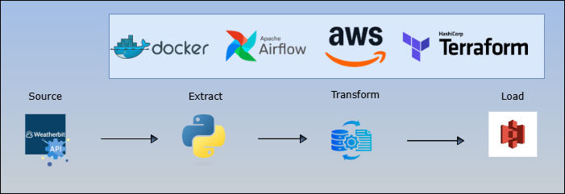

# 🌾 Agricultural Weather Data (specific to Jos, Nigeria) Pipeline (Weatherbit API → AWS S3) 
## 📌 Overview
This project implements an automated data pipeline that retrieves daily agricultural weather forecasts from the Weatherbit API and stores the data in Amazon S3 for downstream analytics and reporting. It is designed with automation, security, and scalability in mind — leveraging Apache Airflow for orchestration and Terraform for infrastructure provisioning.

The pipeline enables the organization to make timely, data-driven agricultural decisions by ensuring fresh, accessible, and well-structured weather data is always available in the data lake.

## Business Problem
The company relies on weather data to support agriculture-related analytics and decision-making. However, this data is only available through a third-party API (Weatherbit), and manual retrieval is inefficient, error-prone, and not scalable for daily ingestion.

Moreover, there is a growing need for infrastructure that ensures secure, automated, and traceable data delivery to a centralized storage system.

## Solution
This project implements a fully automated ETL pipeline that fetches daily agricultural weather forecasts from the Weatherbit API and stores the data in AWS S3. 

The solution is built with the following components:

- **Data Extraction**: The target Weatherbit endpoint provides 8-day agricultural weather forecasts.
- **Transformation**: Basic formatting and timestamping of the response for partitioned storage.
- **Data Load**: Stores the resulting data as Parquet in an Amazon S3 bucket.
- **Automation**: Apache Airflow orchestrates the ETL flow on a daily schedule.
- **Infrastructure as Code**: All AWS infrastructure — including IAM roles, S3 bucket, and access credentials — is provisioned securely using Terraform, with secrets managed in AWS Systems Manager Parameter Store (SSM).

This setup enables scalable, secure, and hands-free access to weather data for downstream teams such as data analysts and agronomists.

## 🌍 Data Source: Weatherbit Ag-Weather Forecast API
Key highlights:
- Provides **8-day forecasts** for any geographic coordinate (latitude and longitude) in the world.
- Includes **30+ agricultural weather fields**, such as:
  - Soil temperature
  - Precipitation
  - Soil moisture
  - Evapotranspiration
  - Solar radiation
  - And more!

## Architecture Diagram

## Features
- Secure and automated weather data ingestion
- Timestamped data for historical tracking
- Airflow DAG for scheduling and monitoring
- AWS Infrastructure defined with `Terraform`
- Secrets stored in `SSM Parameter Store`

## How to Deploy
1. `terraform apply` to set up infrastructure
2. Configure Airflow environment
3. Set environment variables or mount secrets
4. Trigger DAG or wait for scheduler

## Technologies Used
- Apache Airflow
- Python
- AWS (S3, IAM, SSM)
- Terraform
- Weatherbit API

<!-- ## Future Improvements
- Add schema validation
- Introduce error handling & retries
- Extend to multiple locations or metrics -->

## Author
Taofeecoh Adesanu – Data Engineer
